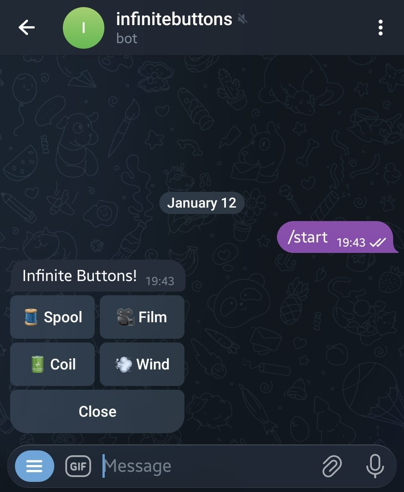

# Infinite Buttons Telegram Bot

A discovery game Telegram bot built with Nitro and Cloudflare Workers. Users
explore a tree of "buttons" (items) where new branches are generated on-the-fly
using Cloudflare AI.

<p align="center">
  
</p>

## Game Mechanics

**Infinite Buttons** is an exploration game where players navigate through an
infinite tree of items. The game starts with four root elements representing the
classical elements: Water 💧, Fire 🔥, Air 💨, and Earth 🌍.

### How to Play

1. **Start**: Use `/start` to begin your journey. You'll see the four root
   elements as clickable buttons.

2. **Explore**: Click on any button to navigate deeper into that branch of the
   tree. Each button represents an item with a name and emoji.

3. **Discover**: When you click on a button that doesn't have children yet, the
   AI generates up to 4 new related items on-the-fly. These items are
   semantically similar to the parent item and are added to the database for
   future players to discover.

4. **Navigate**: The game uses alternating menus that allow you to move between
   different branches. You can always close the menu and start fresh with
   `/start`.

### Game Features

- **Infinite Exploration**: The tree grows as players explore, with AI-generated
  content creating new branches dynamically.
- **Shared Discovery**: Items discovered by one player become available to all
  players, creating a collaborative exploration experience.
- **Session Tracking**: The bot tracks your current position, navigation history,
  and discovered items throughout your session.

## Tech Stack

- **Framework**: [Nitro](https://nitro.build/) (Cloudflare Module preset)
- **Bot Framework**: [grammY](https://grammy.dev/)
- **Database**: [Cloudflare D1](https://developers.cloudflare.com/d1/) with
  [Drizzle ORM](https://orm.drizzle.team/)
- **AI**: [Cloudflare AI](https://developers.cloudflare.com/ai/) (using Llama
  3.3)
- **Deployment**: [Cloudflare Workers](https://workers.cloudflare.com/)

## Configuration

The bot requires the following environment variables. In production, these
should be set as Cloudflare secrets.

- `NITRO_BOT_TOKEN`: Your Telegram Bot API token from
  [@BotFather](https://t.me/BotFather).
- `NITRO_BOT_INFO`: A JSON string representing the bot's info (output of
  `bot.api.getMe()`).
- `NITRO_CLOUDFLARE_API_TOKEN`: Your Cloudflare API token for Nitro operations.
- `NITRO_CLOUDFLARE_ACCOUNT_ID`: Your Cloudflare account ID.

## Commands

### Development

```bash
# Install dependencies
pnpm install

# Start Nitro in development mode
pnpm dev

# Local preview with Wrangler (Cloudflare environment)
pnpm preview
```

### Database

```bash
# Generate Drizzle migrations
pnpm cf:db:generate

# Apply migrations to the Cloudflare D1 database (remote)
pnpm cf:db:migrate
```

### Deployment

```bash
# Typecheck, build, and deploy to Cloudflare
pnpm cf:deploy
```

### Linting

```bash
# Run ESLint
pnpm lint

# Fix linting issues
pnpm lint:fix
```

## Project Structure

- `server/routes/tlg.ts`: Webhook handler for Telegram updates.
- `server/utils/telegram.ts`: Core bot logic, menus, and interaction handlers.
- `server/utils/ai.ts`: Item generation logic using Cloudflare AI.
- `server/db/schema.ts`: Drizzle database schema definitions.
- `wrangler.jsonc`: Cloudflare Workers configuration (D1 and AI bindings).
